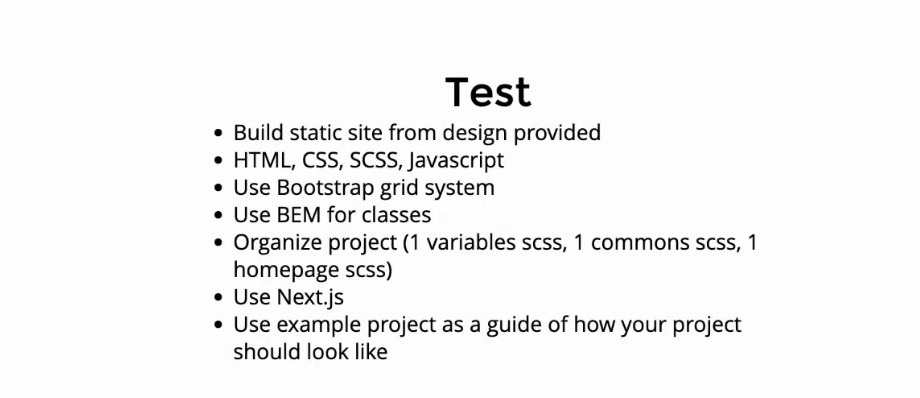

# 87Lux Challange



- [CodingPhase](https://www.youtube.com/watch?v=hPrd67OS0iA) - learn about CodingPhase and his challenge

## Demo


## Dependencies

# Sass

Next.js allows you to import Sass using both the .scss and .sass extensions. You can use component-level Sass via CSS Modules and the .module.scss or .module.sass extension.

```bash
npm install sass
```

You can see I imported my sass file directly withouth having to compile it to css

```bash
import '../sass/page.scss';
```

# Motion

```bash
npm install framer-motion
```

I used the motion API for the animations on this project. You can learn more below.

- [Motion API](https://www.framer.com/api/motion/) - learn about motion

# react-intersection-observer

React implementation of the Intersection Observer API to tell you when an element enters or leaves the viewport. Contains both a Hooks, render props and plain children implementation.

- [react-intersection-observer](https://www.npmjs.com/package/react-intersection-observer)

```bash
npm install react-intersection-observer
```

# Next.js

This is a [Next.js](https://nextjs.org/) project bootstrapped with [`create-next-app`](https://github.com/vercel/next.js/tree/canary/packages/create-next-app).

## Getting started

First, run the development server:

```bash
npm run dev
# or
yarn dev
```

Open [http://localhost:3000](http://localhost:3000) with your browser to see the result.

You can start editing the page by modifying `pages/index.js`. The page auto-updates as you edit the file.

[API routes](https://nextjs.org/docs/api-routes/introduction) can be accessed on [http://localhost:3000/api/hello](http://localhost:3000/api/hello). This endpoint can be edited in `pages/api/hello.js`.

The `pages/api` directory is mapped to `/api/*`. Files in this directory are treated as [API routes](https://nextjs.org/docs/api-routes/introduction) instead of React pages.

## Learn More

To learn more about Next.js, take a look at the following resources:

- [Next.js Documentation](https://nextjs.org/docs) - learn about Next.js features and API.
- [Learn Next.js](https://nextjs.org/learn) - an interactive Next.js tutorial.

You can check out [the Next.js GitHub repository](https://github.com/vercel/next.js/) - your feedback and contributions are welcome!

## Deploy on Vercel

The easiest way to deploy your Next.js app is to use the [Vercel Platform](https://vercel.com/new?utm_medium=default-template&filter=next.js&utm_source=create-next-app&utm_campaign=create-next-app-readme) from the creators of Next.js.

Check out our [Next.js deployment documentation](https://nextjs.org/docs/deployment) for more details.
